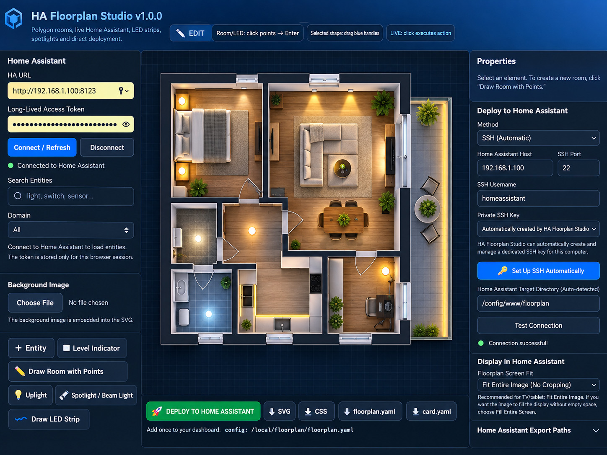

# 🏠 HA Floorplan Studio

### Visual floorplan editor for Home Assistant

HA Floorplan Studio is a visual editor for creating interactive Home Assistant floorplans.

Design your floorplan visually, connect live Home Assistant entities, add lighting effects and deploy the finished project directly to Home Assistant.

---

## 📥 Download

### [⬇️ Download HA Floorplan Studio v1.0.0](https://github.com/HassioMB/HA-Floorplan-Studio/releases/download/v1.0.0/HA-Floorplan-Studio-v1.0.0.zip)

Latest releases:

👉 [GitHub Releases](https://github.com/HassioMB/HA-Floorplan-Studio/releases)

---

## 🖼️ Preview

---

## ✨ Features

- 🖱️ Visual drag-and-drop editor
- 🏠 Interactive floorplans
- 🔗 Live Home Assistant entity connection
- 💡 Room lighting effects
- 🔦 Spotlights and uplights
- 🌈 LED strips and light spill
- 📊 Generic 0–100% level indicators
- 🖼️ Background image support
- 👁️ Live preview
- 💾 Save and load projects
- 📤 SVG, YAML and CSS export
- 🔑 Automatic SSH key setup
- 🔍 Automatic Home Assistant deployment detection
- 🚀 Direct deployment to Home Assistant
- 🔄 Automatic SFTP / SSH shell detection
- 🍎 macOS support
- 🪟 Windows support

---

# 🎨 Recommended floorplan workflow

For the best visual result, I recommend preparing your floorplan image before importing it into HA Floorplan Studio.

You can start with:

- a simple hand-drawn sketch of your house or apartment
- a floorplan created in **Sweet Home 3D**
- another floorplan application
- an existing architectural drawing or image

Once you have the basic layout, you can give the image to **ChatGPT** or another AI image tool and ask it to create a cleaner and more realistic top-down floorplan.

### Suggested workflow

1. Draw or create the basic layout of your home.
2. Export it or take a clear photo of the sketch.
3. Upload the image to ChatGPT or another AI image generator.
4. Ask the AI to create a realistic top-down floorplan while keeping the same room positions and proportions.
5. Save the generated image.
6. Import it into HA Floorplan Studio using **Background Image**.
7. Place your Home Assistant entities on top of the floorplan.

You can then add:

- lights
- switches
- sensors
- cameras
- covers
- level indicators
- LED strips
- spotlights
- other Home Assistant entities

> **Tip:** Always verify that the AI-generated floorplan still matches the real proportions and room positions of your home before adding entities.

This is often the easiest way to get a clean and realistic floorplan without needing advanced 3D or graphic-design skills.

---

# ✅ Requirements

You need:

- Python 3
- A modern web browser
- Home Assistant accessible on your local network

For live Home Assistant entities you also need a **Long-Lived Access Token**.

SSH is only required if you want to use automatic deployment.

---

# 🍎 macOS Installation

1. Download the latest release.
2. Extract the ZIP archive.
3. Open the `HA-Floorplan-Studio-v1.0.0` folder.
4. Double-click:

   `Start on macOS.command`

5. The first launch automatically creates a local Python environment and installs the required dependencies.
6. Your browser will open automatically at:

   `http://127.0.0.1:8088`

Keep the Terminal window open while using HA Floorplan Studio.

### macOS security warning

If macOS blocks the launcher:

Right-click:

`Start on macOS.command`

and choose:

**Open**

Then confirm again.

---

# 🪟 Windows Installation

1. Download the latest release.
2. Extract the ZIP archive.
3. Open the `HA-Floorplan-Studio-v1.0.0` folder.
4. Double-click:

   `Start on Windows.bat`

5. The first launch automatically creates a local Python environment.
6. Your browser will open automatically at:

   `http://127.0.0.1:8088`

If Python is not installed, install Python 3 first.

During Python installation make sure this option is enabled:

**Add Python to PATH**

Then start HA Floorplan Studio again.

---

# 🔗 Connecting to Home Assistant

In HA Floorplan Studio enter:

- Home Assistant URL
- Long-Lived Access Token

Example:

`http://192.168.1.100:8123`

Then click:

**Connect / Refresh**

Your Home Assistant entities will appear inside the editor.

---

# 🔑 Long-Lived Access Token

In Home Assistant:

1. Open your user profile.
2. Find **Long-Lived Access Tokens**.
3. Create a new token.
4. Copy the token.
5. Paste it into HA Floorplan Studio.

Your token should always remain private.

Never publish your Home Assistant access token.

---

# 🚀 Automatic SSH Setup

HA Floorplan Studio can automatically create a dedicated SSH key for deployment.

Click:

**🔑 Set Up SSH Automatically**

The editor will create a dedicated SSH key on your computer.

The private key stays on your computer.

Only the **public SSH key** should be added to your Home Assistant SSH add-on.

The editor can automatically detect:

- SSH connectivity
- SSH authentication
- SFTP availability
- SSH shell transfer
- common Home Assistant configuration paths
- writable deployment directories
- existing passwordless sudo access

HA Floorplan Studio automatically selects the available deployment method whenever possible.

Possible deployment methods include:

- SFTP
- SSH shell transfer
- SSH shell with existing passwordless sudo

---

# 📂 Home Assistant deployment

The usual destination is:

`/config/www/floorplan`

Depending on the Home Assistant installation, HA Floorplan Studio can also detect other supported configuration paths automatically.

Once the connection test succeeds, click:

**🚀 DEPLOY TO HOME ASSISTANT**

The generated files will be copied directly to Home Assistant.

---

# 📦 Exported files

HA Floorplan Studio can generate:

- `floorplan.svg`
- `floorplan.css`
- `floorplan.yaml`
- `card.yaml`
- `floorplan-project.json`

The project JSON file allows you to save your work and continue editing later.

---

# 🔒 Security

Never publish or share:

- Home Assistant access tokens
- SSH private keys
- passwords
- private credentials

Only the generated **public SSH key** is intended to be copied into the Home Assistant SSH configuration.

HA Floorplan Studio is designed to run locally on your computer.

---

# 🐛 Bugs and feature requests

Found a bug or have an idea?

Use GitHub Issues:

👉 [Open an issue](https://github.com/HassioMB/HA-Floorplan-Studio/issues)

Feedback from different Home Assistant installations is especially welcome.

---

# 📧 Contact

Questions, feedback or suggestions:

**hassio@tutamail.com**

---

# ❤️ Support the project

HA Floorplan Studio is free and open source.

If you find it useful and would like to support continued development:

### 💳 Revolut

**@markoob03**

https://revolut.me/markoob03

Every contribution helps with development, testing and future features.

Thank you for supporting HA Floorplan Studio. ❤️

---

# 📄 License

HA Floorplan Studio is released under the **MIT License**.

See:

[LICENSE](LICENSE)

---

# ⚠️ Disclaimer

HA Floorplan Studio is an independent community project.

It is not affiliated with, sponsored by or endorsed by Home Assistant or Nabu Casa.

Always keep backups of important Home Assistant configuration files before making changes.
